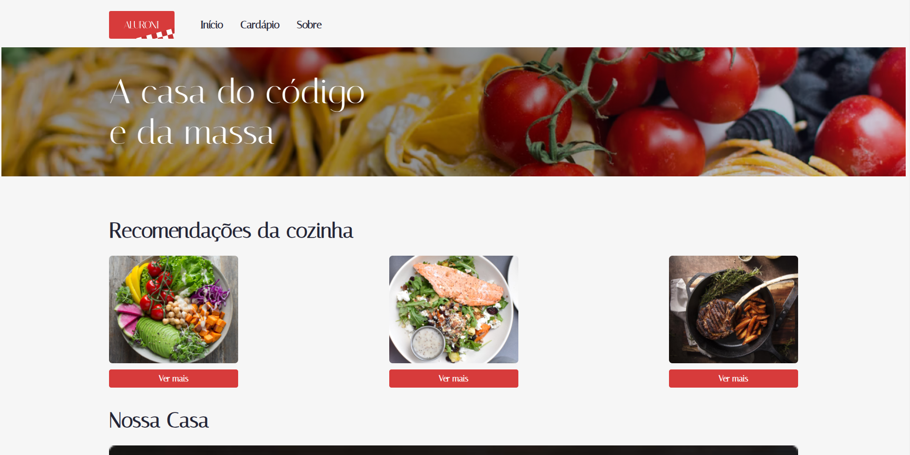

# Application Information

MyAluroni is user-friendly React application designed to a restaurant website. It empowers you to see the menu, meals, filter and know more about the restaurant. Built with React and TypeScript, this project adheres to clean coding principles like DRY (Don't Repeat Yourself) and SRP (Single Responsibility Principle) for maintainability,
ESLint, React ROunter DOM, useLocation, useParams, Navigate, nested routes and much more routes in React.

Here some images:

# Getting Started with Create React App

This project was bootstrapped with [Create React App](https://github.com/facebook/create-react-app).

## Available Scripts

After downloading this project, go to the project and use:

### `npm install`

In the project directory, you can run:

### `npm run dev`

Runs the app in the development mode.\
Open [http://localhost:3000](http://localhost:3000) to view it in the browser.

The page will reload if you make edits.\
You will also see any lint errors in the console.

You can also use the following commands:

### `npm test`

Launches the test runner in the interactive watch mode.\
See the section about [running tests](https://facebook.github.io/create-react-app/docs/running-tests) for more information.

### `npm run build`

Builds the app for production to the `build` folder.\
It correctly bundles React in production mode and optimizes the build for the best performance.

The build is minified and the filenames include the hashes.\
Your app is ready to be deployed!

See the section about [deployment](https://facebook.github.io/create-react-app/docs/deployment) for more information.

## Learn More

You can learn more in the [Create React App documentation](https://facebook.github.io/create-react-app/docs/getting-started).

To learn React, check out the [React documentation](https://reactjs.org/).
